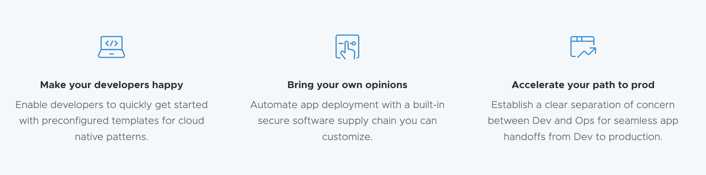

Table of Contents
=================

* [What is Tanzu Application Platform - TAP](#what-is-tanzu-application-platform---tap)
* [Packages](#packages)
* [Prerequisites](#prerequisites)
* [Instructions](#instructions)
    * [Introduction](#introduction)
    * [How to install TAP](#how-to-install-tap)
    * [Testing TAP](#testing-tap)
    * [Using a private registry](#using-a-private-registry)
    * [Tanzu Client](#tanzu-client)
    * [Review what it has been installed](#review-what-it-has-been-installed)
    * [Change TAP configuration](#change-tap-configuration)
* [Clean](#clean)

## What is Tanzu Application Platform - TAP

Tanzu Application Platform - https://docs.vmware.com/en/VMware-Tanzu-Application-Platform/1.3/tap/GUID-overview.html is according to [VMWare](https://tanzu.vmware.com/application-platform)
a modular, application-aware platform that provides a rich set of developer tooling and a prepaved path to production to build and deploy software
quickly and securely on any compliant public cloud or on-premises Kubernetes cluster.

TAP 1.0 has been released in January 2022 and different versions are regularly produced - see [releases note](https://network.pivotal.io/products/tanzu-application-platform/releases). 

By supporting the [Supply Chain choreograph](https://cartographer.sh/) pattern, TAP allows
to decouple the path to move a microservice to different kubernetes environments (build, scan, CI/CD, test, ...)
from the development lifecycle process followed by the developers.



TAP rely on some key components such as:

- `Knative`serving and eventing,
- `kpack` controller able to build images using `Buildpacks`,
- `Contour` to route the traffic internally or externally using `Ingress`
- `kapp` controller to install/uninstall K8s resources using templates (ytt, ...)
- `Application Live & Application Accelerator` to guide the Architects/Developers to design/deploy/monitor applications on k8s.
- `Tekton pipelines` and `FluxCD` to fetch the sources (git, ...)
- `Convention` controller able to change the `Workloads` according to METADATA (framework, runtime, ...)
- `Service Binding & Toolkit` able to manage locally the services,
- `Cartographer` which allows `App Operators` to create pre-approved paths to production by integrating Kubernetes resources with the elements of toolchains (e.g. Jenkins, CI/CD,...).

## Packages

See the following file to get an overview about the different TAP packages [here](./packages.md).

**Note**: To discover how to build your own Carvel package and repository, check this [page](carvel-package/README.md).

## Prerequisites

The following [installation](https://docs.vmware.com/en/VMware-Tanzu-Application-Platform/1.3/tap/GUID-prerequisites.html) guide explains what the prerequisites are.

TL&DR; It is needed to:

- Have a [Tanzu account](https://network.tanzu.vmware.com/) to download the software or access the [Tanzu registry](registry.tanzu.vmware.com),
- Accept the needed [EULA](https://docs.vmware.com/en/VMware-Tanzu-Application-Platform/1.3/tap/GUID-install-tanzu-cli.html#accept-the-end-user-license-agreements-0)
- Have a kind cluster >= 1.22 installed with a private docker registry. Use this [script](https://github.com/snowdrop/k8s-infra/blob/main/kind/kind-tls-secured-reg.sh)
- Have a Linux VM machine with at least 8 CPUs, 8 GB of RAM and 100Gb (if you plan to use locally a container registry)
- Private container registry such as [Harbor](harbor.md) (optional) exposed using a NodePort on the cluster (e.g: registry.harbor.VM_IP.nip.io:32443)

## Instructions

### Introduction

The instructions of the official [guide](https://docs.vmware.com/en/VMware-Tanzu-Application-Platform/index.html) have been executed without problem
to install the release [1.3.0](https://docs.vmware.com/en/VMware-Tanzu-Application-Platform/1.3/tap/GUID-release-notes.html).

To simplify your life, we have designed a [bash script](scripts/install.sh) which allows to install the different bits in a VM:

1. Cluster Essentials (= [bundle image](registry.tanzu.vmware.com/tanzu-cluster-essentials/cluster-essentials-bundle) packaging Carvel Tools & 2 Kubernetes controllers)
   - [Carvel tools](https://carvel.dev/): ytt, imgpkg, kbld, kapp
   - [Kapp controller](https://carvel.dev/kapp-controller/),
   - [Secretgen controller](https://github.com/vmware-tanzu/carvel-secretgen-controller)
2. [Tanzu client](https://github.com/vmware-tanzu/tanzu-framework/blob/main/docs/cli/getting-started.md) and plugins (package, application, secret, etc)
3. TAP Repository

   A repository is an image bundle containing different K8s manifests, templates, files able to install/configure the TAP packages.
   Such a repository are managed using the Tanzu command `tanzu package repository ...`
4. TAP Packages

   The packages are the building blocks or components part of the TAP platform. Each of them will install a specific feature such as Knative, cartographer, contour, cnrs, ...
   They are managed using the following command `tanzu package installed ...`

**NOTE**: Some additional tools which are very helpfull can be installed using the [install_k8s_tools.sh](scripts/install_k8s_tools.sh) bash script such as: unzip, k9s, helm, kubectl krew, kctrl !

### How to install TAP

To install TAP, create first a kind cluster and private docker registry:
```bash
bash <(curl -s -L https://raw.githubusercontent.com/snowdrop/k8s-infra/main/kind/kind-tls-secured-reg.sh)
```
**Important**: Different questions will be asked such as IP of the VM machine, k8s version. Do not install ingress nginx as TAP will deploy ingress contour !
```bash
   _____                                  _
  / ____|                                | |
 | (___    _ __     ___   __      __   __| |  _ __    ___    _ __
  \___ \  | '_ \   / _ \  \ \ /\ / /  / _  | |  __|  / _ \  | \ _ \
  ____) | | | | | | (_) |  \ V  V /  | (_| | | |    | (_) | | |_) |
 |_____/  |_| |_|  \___/    \_/\_/    \__,_| |_|     \___/  |  __/
                                                            | |
                                                            |_|
 Kind installation script

- Deploying a local secured (using htpasswd) docker registry
- Generating a selfsigned certificate (using openssl) to expose the registry as a HTTP/HTTPS endpoint
- Setting a docker network between the containers: kind and registry and alias "registry.local"
- Allowing to access the repository using as address "registry.local:5000" within a pod, from laptop or when a pod is created
- Exposing 2 additional NodePort: 30000 and 31000
- Deploying an ingress controller
- Copying the generated certificate here: /home/snowdrop/local-registry.crt

IP address of the VM running docker - Default: 127.0.0.1 ? 10.0.77.176
Do you want to delete the kind cluster (y|n) - Default: y ? y
Do you want install ingress nginx (y|n) - Default: y ? n
Which kubernetes version should we install (1.18 .. 1.25) - Default: latest ? 1.23
What logging verbosity do you want to use with kind (0..9) - A verbosity setting of 0 logs only critical events - Default: 0 ?
...
```

Next, execute the [install.sh](scripts/install.sh) bash script locally or remotely (ssh) and configure the following parameters:

- **REGISTRY_SERVER**: registry DNS name (docker.io, ghcr.io, quay.io, registry.harbor.<VM_IP>.nip.io:<PORT>)
- **REGISTRY_OWNER**: docker user account, ghcr.io ORG owner, container project (e.g: tap - `registry.harbor.<VM_IP>.nip.io:<PORT>/tap`)
- **REGISTRY_USERNAME**: username to be used to log on to the registry
- **REGISTRY_PASSWORD**: password to be used to log on to the registry
- **REGISTRY_CA_PATH**: Path of the CA certificate used your container registry (optional)
- **TANZU_REG_SERVER**: Tanzu registry from where packages, images can be pulled (e.g: registry.tanzu.vmware.com)
- **TANZU_REG_USERNAME**: user to be used to be authenticated against the Tanzu registry
- **TANZU_REG_PASSWORD**: password to be used to be authenticated against the Tanzu registry

As the script will download different `products` from the https://network.tanzu.vmware.com/ server 
using the tool [pivnet](https://github.com/pivotal-cf/pivnet-cli), then this is why must also configure the following variable
and have a [Tanzu network account like an API account](https://tanzu.vmware.com/developer/guides/tanzu-network-gs/):

- **TANZU_PIVNET_LEGACY_API_TOKEN**: Token used by pivnet CLI to login to the Tanzu products website

Finally, define the home directory and IP address of the VM hosting TAP and the kubernetes cluster:

- **REMOTE_HOME_DIR**: home directory where files will be installed within the VM
- **VM_IP**: IP address of the VM where the cluster is running

**IMPORTANT**: Tanzu recommends to relocate the TAP repository [images](https://docs.vmware.com/en/VMware-Tanzu-Application-Platform/1.3/tap/GUID-install-air-gap.html#relocate-images-to-a-registry-0) 
to your registry from VMware Tanzu Network registry before attempting installation. In this case, set the `COPY_PACKAGES` parameter to `TRUE` the first time you will install TAP 
as the images will be copied using `imgpkg tool`.

Example of commands
```bash
REMOTE_HOME_DIR=<REMOTE_HOME_PATH>
VM_IP=<VM_IP>
REGISTRY_SERVER=<REGISTRY_SERVER>
REGISTRY_OWNER=<REGISTRY_OWNER>
REGISTRY_USERNAME=<REGISTRY_USERNAME>
REGISTRY_PASSWORD=<REGISTRY_PASSWORD>
REGISTRY_CA_PATH=<REGISTRY_CA_PATH>
TANZU_REG_USERNAME=<TANZU_REG_USERNAME>
TANZU_REG_PASSWORD=<TANZU_REG_PASSWORD>
TANZU_PIVNET_LEGACY_API_TOKEN=<TANZU_PIVNET_LEGACY_API_TOKEN>
COPY_PACKAGES="false"
./scripts/install.sh

or 

ssh -i ~/.ssh/id_server_private_key snowdrop@10.0.77.176 -p 22 \
    REMOTE_HOME_DIR="/home/snowdrop" \
    VM_IP="10.0.77.176" \
    REGISTRY_SERVER="10.0.77.176.nip.io:5000" \
    REGISTRY_OWNER="tap" \
    REGISTRY_USERNAME="admin" \
    REGISTRY_PASSWORD="snowdrop" \
    REGISTRY_CA_PATH="/home/snowdrop/_tmp/certs/localhost/client.crt" \
    TANZU_REG_SERVER="registry.tanzu.vmware.com" \
    TANZU_REG_USERNAME="<TANZU_REG_USERNAME>" \
    TANZU_REG_PASSWORD="<TANZU_REG_USERNAME" \
    TANZU_PIVNET_LEGACY_API_TOKEN="<TANZU_PIVNET_LEGACY_API_TOKEN>" \
    COPY_PACKAGES="false" \
    "bash -s" -- < ./scripts/install.sh
```

### Testing TAP

See demo page & instructions [here](demo.md) covering more examples like also to deploy a Quarkus application using a new Supply Chain, the Quarkus Buildpack builder image, etc.

Create first a namespace using the command
```bash
./scripts/populate_namespace_tap.sh demo

or 

ssh -i ${SSH_KEY} ${USER}@${IP} -p ${PORT} \
    "bash -s" -- < ./scripts/populate_namespace_tap.sh demo
```
Next deploy a Web Application using the tanzu client and a workload
```bash
tanzu apps workload create tanzu-java-web-app \
  --git-repo https://github.com/vmware-tanzu/application-accelerator-samples\
  --sub-path tanzu-java-web-app \
  --git-branch main \
  --type web \
  --label app.kubernetes.io/part-of=tanzu-java-web-app \
  --yes \
  --namespace demo
```
Follow the build/deployment and access the service when finished
```bash
tanzu apps workload tail tanzu-java-web-app --namespace demo
tanzu apps workload get tanzu-java-web-app --namespace demo
```
### Using a private registry

As mentioned within the previous section, when we plan to use a private local registry such as [Harbor](harbor.md) or docker, some additional steps are required such as:

1. Get the CA certificate file from the registry and set the parameter `REGISTRY_CA_PATH` for the bash script (e.g. _tmp/certs/localhost/client.crt)

2. Get the TAP packages and push them to the private registry

```bash
imgpkg copy -b registry.tanzu.vmware.com/tanzu-application-platform/tap-packages:1.3.0 --to-tar packages.tar
imgpkg copy --tar packages.tar --to-repo <VM_IP>.sslip.io:<PORT>/tap/tap-packages
```

3. Define the TAP `shared` key within the `tap-values.yaml` file to pass the `ca_cert_data` (see [doc](https://docs.vmware.com/en/VMware-Tanzu-Application-Platform/1.1/tap/GUID-install.html#identify-the-values-for-your-package-5))
```bash
shared:
  ca_cert_data: |
      -----BEGIN CERTIFICATE-----
      MIIDFDCCAfygAwIBAgIRAJqAGNrteyM97HLF2i1OhpQwDQYJKoZIhvcNAQELBQAw
      FDESMBAGA1UEAxMJaGFyYm9yLWNhMB4XDTIyMDYwMzEwMDc1M1oXDTIzMDYwMzEw
      ...
      H1H7yyFbxeaRK33ctKxXq2FzEYePYQ0BdTw36O8/R5CXwTMYvbG+kRMmNlRNHhD7
      82elfYZx4DxrWcap2uqrvrR8A8jnV5oa/sBoqcY6U1rIXG2mkVXvuvihOjIm8wHy
      8dHt3pESuqbOo2aDt9uP77sBIjho0JBT
      -----END CERTIFICATE-----
...      
```

**REMARK**
The steps 2 and 3 are managed by the `install.sh` script !

### Tanzu Client

FYI: The `install.sh` bash script installs the Tanzu client as described hereafter like the carvel tools: imgpkg, kapp, kbld, pivnet !

The Tanzu [client](https://network.tanzu.vmware.com/products/tanzu-application-platform/#/releases/1095326) can be installed locally on a machine
having access to the k8s cluster running TAP using the pivnet tool.

According to the TAP release that you would like to install, select the appropriate `product-file-id` and `release-version` from the 
download page of the Tanzu Application Platform product/release - https://network.tanzu.vmware.com/products/tanzu-application-platform.

Next, install the tool using by example the following instructions on a Mac machine. 

**Note**: The instructions are equivalent on Linux except the TAR file to be downloaded !

```bash
pivnet download-product-files --product-slug='tanzu-application-platform' --release-version='1.3.0' --product-file-id=1212837
tar -vxf tanzu-framework-darwin-amd64.tar
install cli/core/v0.11.4/tanzu-core-darwin_amd64 /usr/local/bin/tanzu
export TANZU_CLI_NO_INIT=true
tanzu plugin install --local cli all
tanzu plugin list
```

### Review what it has been installed

- Check the status of the TAP packages installed and if all the packages are well deployed

```bash
tanzu package installed list -n tap-install
/ Retrieving installed packages...
  NAME                      PACKAGE-NAME                                  PACKAGE-VERSION  STATUS
  accelerator               accelerator.apps.tanzu.vmware.com             1.0.0            Reconcile succeeded
  appliveview               run.appliveview.tanzu.vmware.com              1.0.1            Reconcile succeeded
  appliveview-conventions   build.appliveview.tanzu.vmware.com            1.0.1            Reconcile succeeded
  buildservice              buildservice.tanzu.vmware.com                 1.4.2            Reconcile succeeded
  cartographer              cartographer.tanzu.vmware.com                 0.1.0            Reconcile succeeded
  cert-manager              cert-manager.tanzu.vmware.com                 1.5.3+tap.1      Reconcile succeeded
  cnrs                      cnrs.tanzu.vmware.com                         1.0.0            Reconcile succeeded
  contour                   contour.tanzu.vmware.com                      1.08.2+tap.1     Reconcile succeeded
  conventions-controller    controller.conventions.apps.tanzu.vmware.com  0.5.0            Reconcile succeeded
  developer-conventions     developer-conventions.tanzu.vmware.com        0.5.0-build.1    Reconcile succeeded
  fluxcd-source-controller  fluxcd.source.controller.tanzu.vmware.com     0.16.0           Reconcile succeeded
  ootb-delivery-basic       ootb-delivery-basic.tanzu.vmware.com          0.5.1            Reconcile succeeded
  ootb-supply-chain-basic   ootb-supply-chain-basic.tanzu.vmware.com      0.5.1            Reconcile succeeded
  ootb-templates            ootb-templates.tanzu.vmware.com               0.5.1            Reconcile succeeded
  service-bindings          service-bindings.labs.vmware.com              0.6.0            Reconcile succeeded
  services-toolkit          services-toolkit.tanzu.vmware.com             0.5.0            Reconcile succeeded
  source-controller         controller.source.apps.tanzu.vmware.com       0.2.0            Reconcile succeeded
  spring-boot-conventions   spring-boot-conventions.tanzu.vmware.com      0.3.0            Reconcile succeeded
  tap                       tap.tanzu.vmware.com                          1.0.0            Reconcile succeeded
  tap-gui                   tap-gui.tanzu.vmware.com                      1.0.1            Reconcile succeeded
  tap-telemetry             tap-telemetry.tanzu.vmware.com                0.1.2            Reconcile succeeded
  tekton-pipelines          tekton.tanzu.vmware.com                       0.30.0           Reconcile succeeded
  
# or individually
tanzu package installed get -n tap-install <package_name>
```

### Change TAP configuration

- If some parameters should be changed, you can first check the list of the available values for a package:

```bash
tanzu package available get ootb-supply-chain-basic.tanzu.vmware.com/0.5.1 -n tap-install --values-schema
```

- Next edit and change the `tap-values.yaml` file created
- Update finally the TAP package using the following command:

```bash
tanzu package installed update tap -p tap.tanzu.vmware.com -v 1.0.0 --values-file tap-values.yml -n tap-install
```

- To install a package individually, use the following [documentation](https://docs.vmware.com/en/Tanzu-Application-Platform/1.0/tap/GUID-install-components.html) page

## Clean

To delete TAP, execute the following bash script able to delete the packages, repository, workload and installed controllers

```console
$ ./scripts/uninstall.sh
```

That's all !

